# @genart-dev/plugin-particles

Depth-aware atmospheric particle layers for [genart.dev](https://genart.dev) — falling, floating, scatter, mist, and trailing effects. 34 presets across 5 categories, with 9 MCP tools for AI-agent control.

Part of [genart.dev](https://genart.dev) — a generative art platform with an MCP server, desktop app, and IDE extensions.

## Install

```bash
npm install @genart-dev/plugin-particles
```

## Usage

```typescript
import particlesPlugin from "@genart-dev/plugin-particles";
import { createDefaultRegistry } from "@genart-dev/core";

const registry = createDefaultRegistry();
registry.registerPlugin(particlesPlugin);

// Or access individual exports
import {
  ALL_PRESETS,
  getPreset,
  filterPresets,
  searchPresets,
  fallingLayerType,
  floatingLayerType,
  scatterLayerType,
  mistLayerType,
} from "@genart-dev/plugin-particles";
```

## Layer Types (5)

| Layer Type | Category | Default Preset | Description |
|---|---|---|---|
| `particles:falling` | Falling (9) | `snow` | Snow, rain, leaves, petals, ash, embers, needles — depth-aware falling particles |
| `particles:floating` | Floating (8) | `dust-motes` | Dust motes, fireflies, fog wisps, pollen, seeds, butterflies — organic noise drift |
| `particles:scatter` | Scatter (6) | `fallen-leaves` | Fallen leaves, stones, flowers, shells, acorns — perspective-aware ground plane |
| `particles:mist` | Mist (6) | `morning-mist` | Noise-modulated fog bands rendered at 1/4 resolution for performance |
| `particles:trailing` | Trailing (5) | `meteor-shower` | Meteors, speed rain, shooting stars, light trails — streak particles with glow |

## Presets (34)

### Falling (9)

[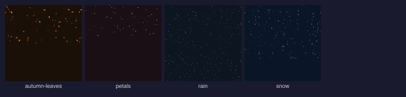](#falling-9)

| Preview | ID | Name | Description |
|---|---|---|---|
| [](examples/falling/snow.png) | `snow` | Snow | Gentle snowfall with depth-scaled flakes drifting in light wind |
| [](examples/falling/rain.png) | `rain` | Rain | Streaking raindrops falling at a steep angle with subtle wind |
| [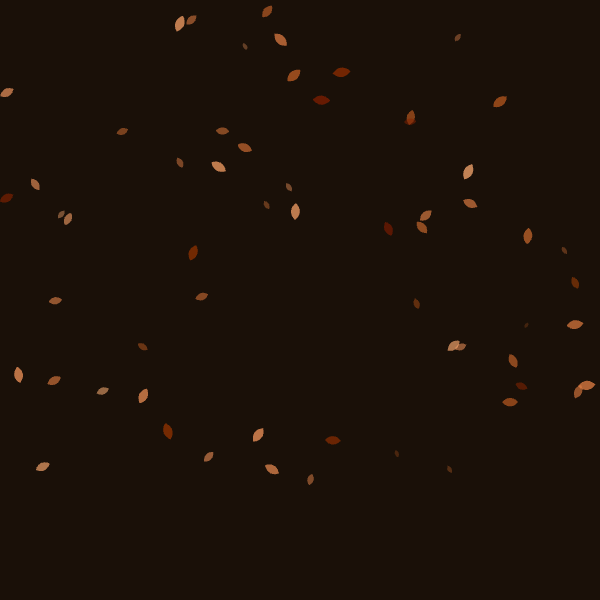](examples/falling/autumn-leaves.png) | `autumn-leaves` | Autumn Leaves | Warm-toned leaves tumbling through the air with varied rotation |
| [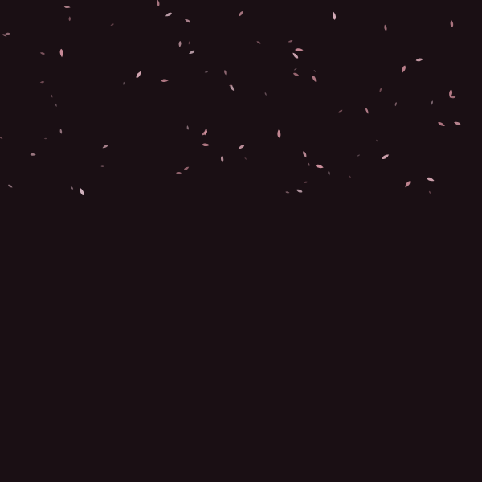](examples/falling/petals.png) | `petals` | Cherry Blossom Petals | Delicate pink petals drifting and swirling on a spring breeze |
| [](examples/falling/embers.png) | `embers` | Embers | Glowing hot embers rising and drifting from a fire |
| [](examples/falling/ash-fall.png) | `ash-fall` | Ash Fall | Grey volcanic ash drifting down in still air |
| [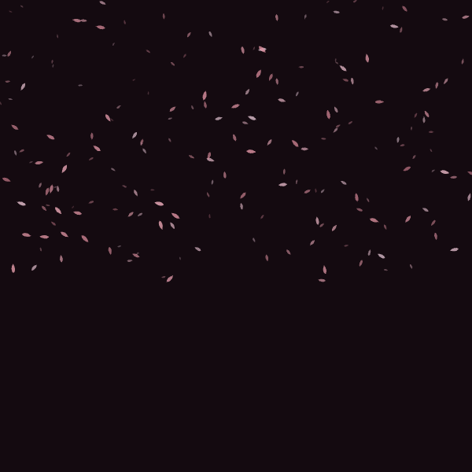](examples/falling/cherry-blossoms.png) | `cherry-blossoms` | Cherry Blossoms | Dense shower of cherry blossoms in a spring storm |
| [](examples/falling/confetti.png) | `confetti` | Confetti | Colorful confetti pieces tumbling chaotically through the air |
| [](examples/falling/pine-needles.png) | `pine-needles` | Pine Needles | Thin pine needles falling from conifers in autumn wind |

### Floating (8)

[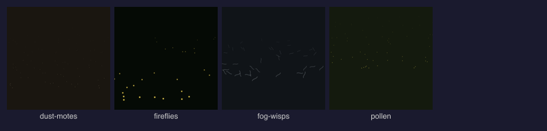](#floating-8)

| Preview | ID | Name | Description |
|---|---|---|---|
| [](examples/floating/dust-motes.png) | `dust-motes` | Dust Motes | Tiny dust particles catching light as they drift in still air |
| [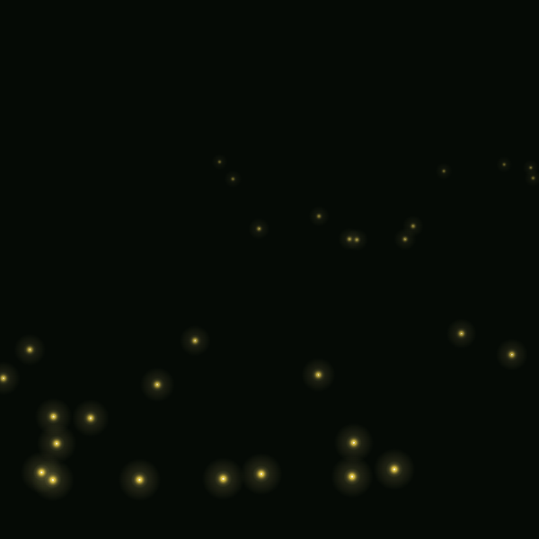](examples/floating/fireflies.png) | `fireflies` | Fireflies | Warm glowing fireflies hovering in the dark with radial glow |
| [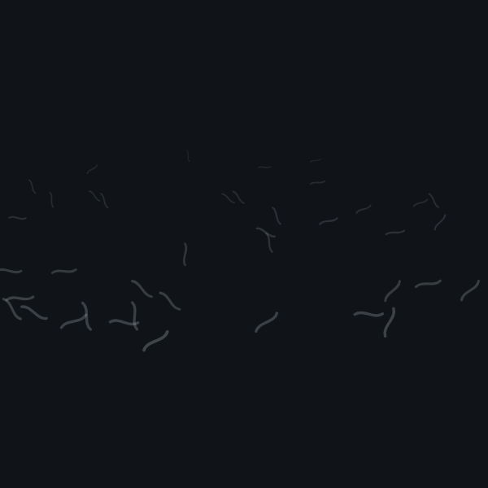](examples/floating/fog-wisps.png) | `fog-wisps` | Fog Wisps | Thin curving wisps of fog drifting at mid-height |
| [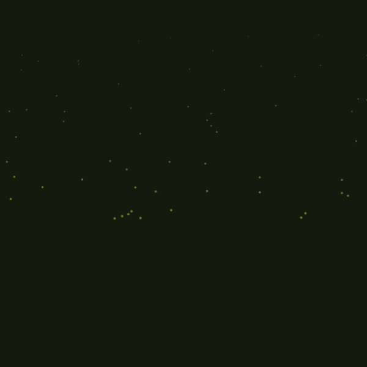](examples/floating/pollen.png) | `pollen` | Pollen | Drifting pollen grains floating in warm sunlight |
| [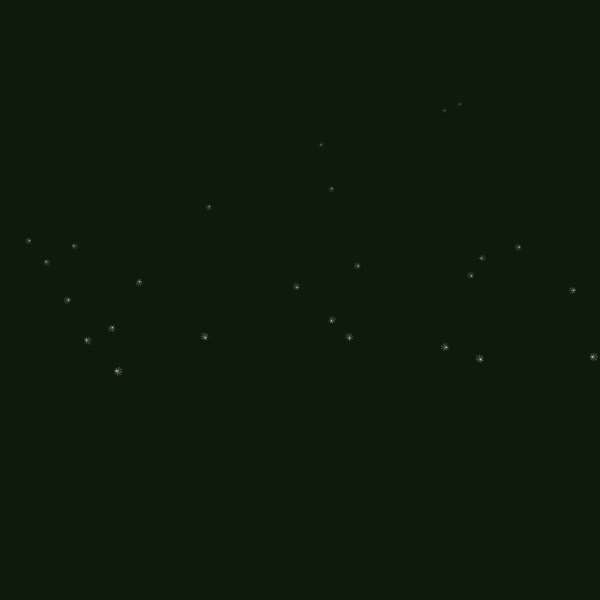](examples/floating/dandelion-seeds.png) | `dandelion-seeds` | Dandelion Seeds | Wispy dandelion seeds floating on gentle currents |
| [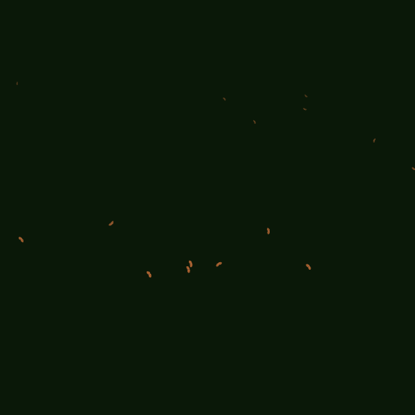](examples/floating/butterflies.png) | `butterflies` | Butterflies | Colorful butterflies fluttering through a meadow |
| [](examples/floating/bubbles.png) | `bubbles` | Bubbles | Translucent soap bubbles drifting upward with highlights |
| [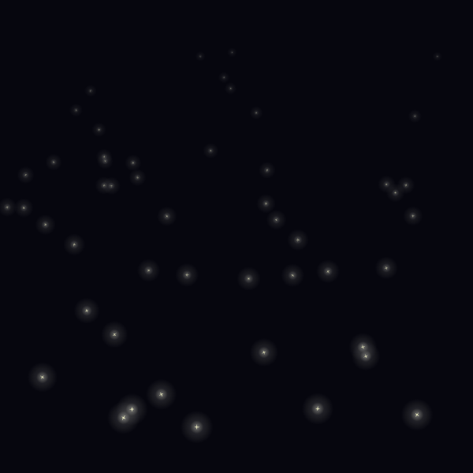](examples/floating/sparkles.png) | `sparkles` | Sparkles | Bright sparkle points twinkling in the air |

### Scatter (6)

[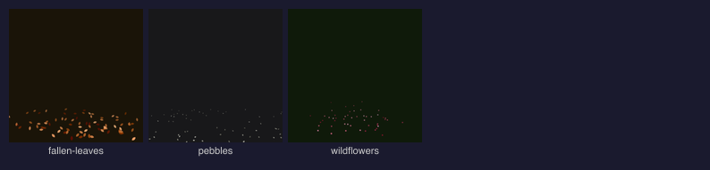](#scatter-6)

| Preview | ID | Name | Description |
|---|---|---|---|
| [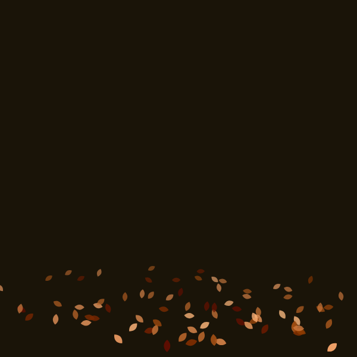](examples/scatter/fallen-leaves.png) | `fallen-leaves` | Fallen Leaves | Autumn leaves scattered on the ground with warm color variation |
| [](examples/scatter/pebbles.png) | `pebbles` | Pebbles | Small stones scattered across a ground plane with natural clustering |
| [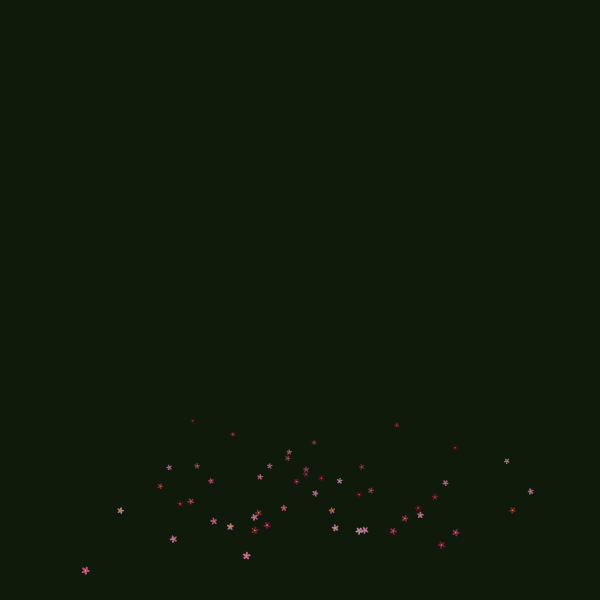](examples/scatter/wildflowers.png) | `wildflowers` | Wildflowers | Colorful wildflowers dotting a meadow with center-weighted density |
| [](examples/scatter/shells.png) | `shells` | Shells | Seashells scattered along a beach shore |
| [](examples/scatter/acorns.png) | `acorns` | Acorns | Acorns scattered beneath oak trees in clustered groups |
| [](examples/scatter/sea-foam.png) | `sea-foam` | Sea Foam | Foamy bubbles along a shoreline edge |

### Mist (6)

[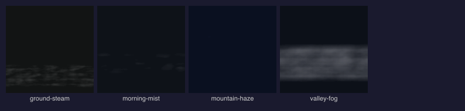](#mist-6)

| Preview | ID | Name | Description |
|---|---|---|---|
| [](examples/mist/morning-mist.png) | `morning-mist` | Morning Mist | Soft mist hovering low in morning light, cool-white top fading to warm gold |
| [](examples/mist/valley-fog.png) | `valley-fog` | Valley Fog | Dense fog filling a valley floor with layered depth and soft edges |
| [](examples/mist/mountain-haze.png) | `mountain-haze` | Mountain Haze | Thin atmospheric haze across a wide elevation range |
| [](examples/mist/ground-steam.png) | `ground-steam` | Ground Steam | Rising steam from warm ground with tight low band and vertical drift |
| [](examples/mist/ground-steam-thick.png) | `ground-steam-thick` | Ground Steam (Thick) | Dense billowing steam rising from hot ground with heavy layering |
| [](examples/mist/smoke-wisps.png) | `smoke-wisps` | Smoke Wisps | Thin wisps of smoke curling upward with organic noise patterns |

### Trailing (5)

[](#trailing-5)

| Preview | ID | Name | Description |
|---|---|---|---|
| [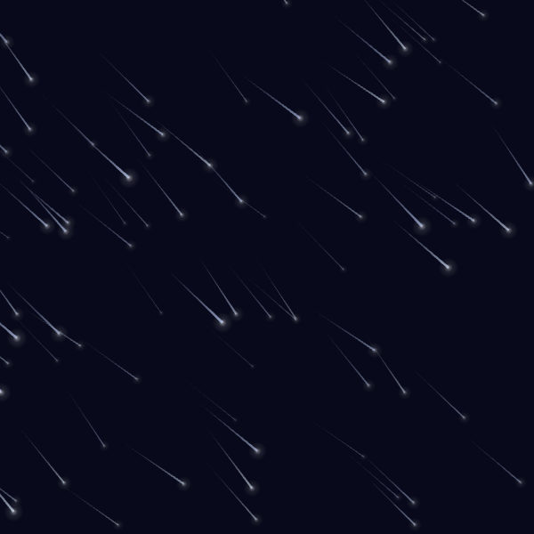](examples/trailing/meteor-shower.png) | `meteor-shower` | Meteor Shower | Blue-white meteors streaking across a night sky with glowing heads |
| [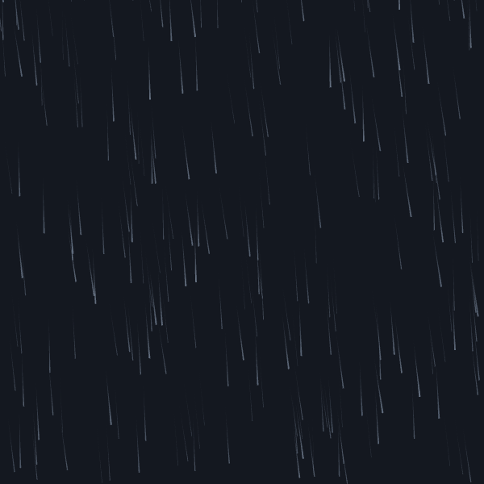](examples/trailing/speed-rain.png) | `speed-rain` | Speed Rain | Dense near-vertical rain streaks with depth |
| [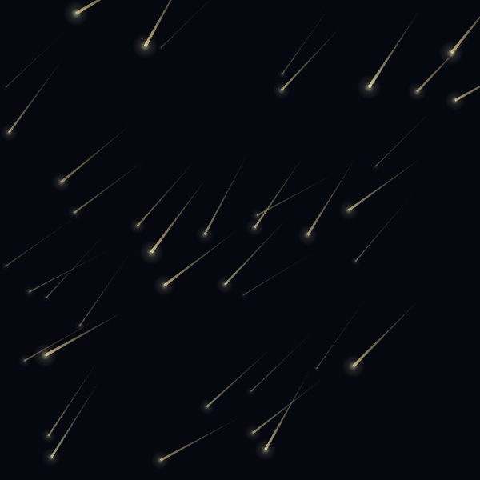](examples/trailing/shooting-stars.png) | `shooting-stars` | Shooting Stars | Warm golden shooting stars arcing with soft glowing heads |
| [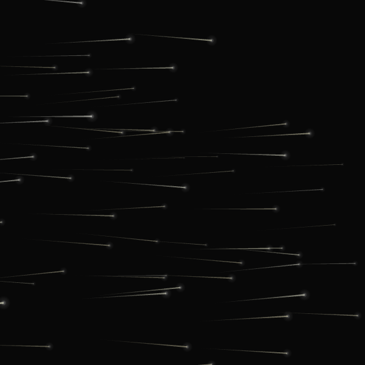](examples/trailing/light-trails.png) | `light-trails` | Light Trails | Horizontal warm light streaks — long exposure bokeh effect |
| [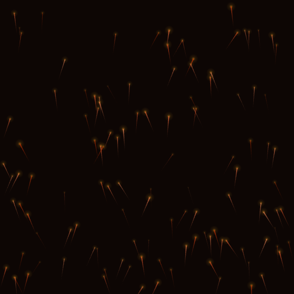](examples/trailing/rising-sparks.png) | `rising-sparks` | Rising Sparks | Orange-red sparks and embers rising upward in a spreading fan |

## Shared Depth System

All particle layers share a common depth model that controls how particles recede into the scene:

- **DepthEasing** — `linear`, `quadratic`, `cubic`, `exponential` curves for size and opacity falloff
- **DepthDistribution** — `uniform`, `foreground-heavy`, `background-heavy`, `midground` control particle density placement
- **`computeDepth()`** — Returns 0..1 depth value for a particle based on its position and the horizon line
- **`applyDepthToParticle()`** — Scales size and opacity for a particle given its depth value and easing curve
- **`sampleDepthDistribution()`** — Samples a random depth value biased by the chosen distribution mode

```typescript
import {
  applyDepthEasing,
  computeDepth,
  applyDepthToParticle,
  sampleDepthDistribution,
} from "@genart-dev/plugin-particles";
```

## 22 Shape Renderers

Each particle type has a dedicated canvas2d shape renderer:

| Category | Shapes |
|---|---|
| Falling (9) | `circle`, `snowflake`, `raindrop`, `leaf`, `petal`, `ash`, `dust`, `ember`, `needle` |
| Floating (8) | `dot`, `wisp`, `firefly`, `pollen`, `sparkle`, `butterfly`, `bubble`, `seed-tuft` |
| Scatter (7) | `leaf`, `stone`, `flower`, `debris`, `petal`, `acorn`, `shell` |

```typescript
import {
  getFallingShape,
  getFloatingShape,
  getScatterShape,
  drawSnowflake,
  drawFirefly,
  drawStone,
} from "@genart-dev/plugin-particles";
```

## MCP Tools (9)

Exposed to AI agents through the MCP server when this plugin is registered:

| Tool | Description |
|---|---|
| `add_particles` | Add a particle layer by preset (auto-resolves layer type from preset category). 34 presets. |
| `list_particle_presets` | List all presets, optionally filtered by category (falling/floating/scatter/mist/trailing) |
| `set_particle_depth` | Configure depth: horizonY, depthEasing, depthDistribution, depthBandMin/Max |
| `set_particle_motion` | Configure motion: windAngle, windStrength, fallProgress, driftRange, driftPhase, driftX |
| `set_particle_style` | Configure style: color, colorVariation, opacity, glow, glowColor, sizeMin, sizeMax |
| `set_depth_lane` | Assign a particle layer to a depth lane (foreground/midground/background) with sub-level |
| `create_atmosphere` | Compose a multi-layer atmospheric scene from 6 built-in recipes |
| `randomize_particles` | Generate a random particle layer, optionally constrained by category |
| `set_mist_band` | Configure mist: bandTop, bandBottom, edgeSoftness, density, noiseScale, layerCount |

## Atmosphere Recipes (6)

The `create_atmosphere` tool composes multi-layer scenes from curated preset combinations:

[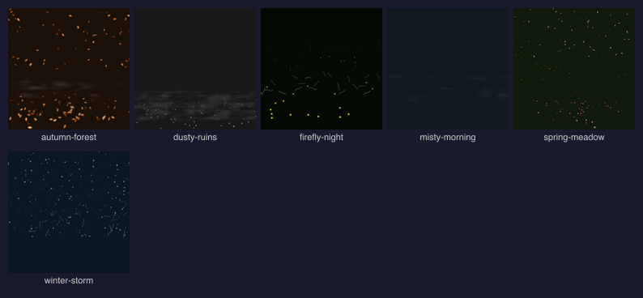](#atmosphere-recipes-6)

| Preview | Recipe | Layers | Description |
|---|---|---|---|
| [](examples/atmosphere/winter-storm.png) | `winter-storm` | snow + fog-wisps + mountain-haze | Heavy snowfall with obscuring mist and distant haze |
| [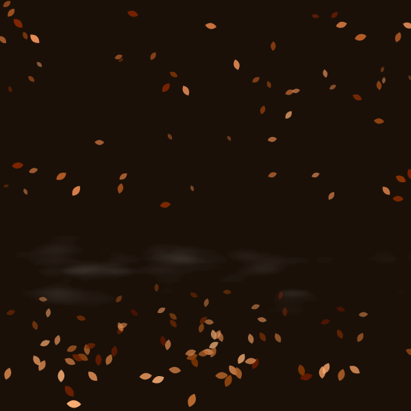](examples/atmosphere/autumn-forest.png) | `autumn-forest` | autumn-leaves + fallen-leaves + morning-mist | Falling and fallen leaves in a misty forest |
| [](examples/atmosphere/misty-morning.png) | `misty-morning` | morning-mist + dust-motes | Soft low mist with sunlit dust particles |
| [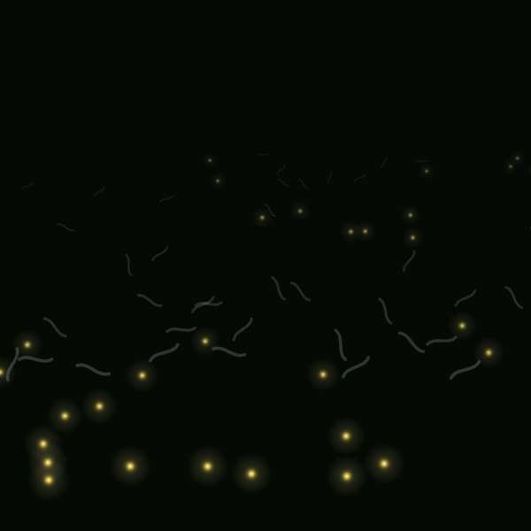](examples/atmosphere/firefly-night.png) | `firefly-night` | fireflies + fog-wisps | Glowing fireflies drifting through night fog |
| [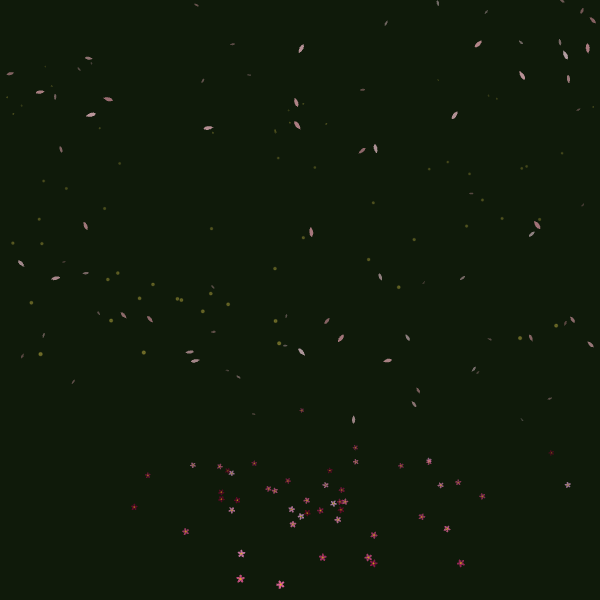](examples/atmosphere/spring-meadow.png) | `spring-meadow` | petals + pollen + wildflowers | Drifting petals and pollen above a wildflower meadow |
| [](examples/atmosphere/dusty-ruins.png) | `dusty-ruins` | dust-motes + pebbles + ground-steam | Dust and steam rising among scattered rubble |

## Rendering

Each layer type renders via canvas2d:

- **Falling** — Seed-deterministic positions with depth-scaled size and opacity; 7 shape renderers (snowflake, raindrop, leaf, petal, ash, dust, circle)
- **Floating** — Fractal noise drift per particle (no grid sync artifacts); `driftPhase` offsets the noise field; `verticalBias` skews the Y distribution; `glowRadius` controls halo size
- **Scatter** — Elements scattered between `groundY` and canvas bottom with perspective depth scaling size and opacity
- **Mist** — Fractal noise sampled into a 1/4-resolution buffer, then scaled up for soft fog bands with configurable edge softness

## Utilities

Shared utilities exported for advanced use:

```typescript
import {
  mulberry32,                          // Deterministic PRNG
  createValueNoise, createFractalNoise, // Procedural noise generators
  parseHex, toHex, lerpColor, varyColor, // Color interpolation and variation
  applyDepthEasing,                    // Depth curve functions
} from "@genart-dev/plugin-particles";
```

## Preset Discovery

```typescript
import { ALL_PRESETS, filterPresets, searchPresets, getPreset } from "@genart-dev/plugin-particles";

// All 34 presets
console.log(ALL_PRESETS.length); // 34

// Filter by category
const falling = filterPresets({ category: "falling" });   // 9 presets
const mist = filterPresets({ category: "mist" });         // 6 presets

// Full-text search
const results = searchPresets("fire"); // fireflies

// Look up by ID
const preset = getPreset("snow");
```

## Examples

The `examples/` directory contains 40 `.genart` files (34 individual presets + 6 atmosphere recipes) with rendered PNG thumbnails.

```bash
# Generate .genart example files
node generate-examples.cjs

# Render all examples to PNG (requires @genart-dev/cli)
node render-examples.cjs

# Generate per-category gallery montages
bash generate-galleries.sh
```

A workspace file at `examples/particles-gallery.genart-workspace` lays out all examples in a grid for browsing in the desktop app.

## Related Packages

| Package | Purpose |
|---|---|
| [`@genart-dev/core`](https://github.com/genart-dev/core) | Plugin host, layer system (dependency) |
| [`@genart-dev/mcp-server`](https://github.com/genart-dev/mcp-server) | MCP server that surfaces plugin tools to AI agents |
| [`@genart-dev/plugin-terrain`](https://github.com/genart-dev/plugin-terrain) | Sky, terrain profiles, clouds, water surfaces (21 presets) |
| [`@genart-dev/plugin-painting`](https://github.com/genart-dev/plugin-painting) | Vector-field-driven painting layers |
| [`@genart-dev/plugin-perspective`](https://github.com/genart-dev/plugin-perspective) | Perspective grids and depth guides |
| [`@genart-dev/plugin-plants`](https://github.com/genart-dev/plugin-plants) | Algorithmic plant generation (110 presets) |
| [`@genart-dev/plugin-patterns`](https://github.com/genart-dev/plugin-patterns) | Geometric and cultural pattern fills (153 presets) |

## Support

Questions, bugs, or feedback — [support@genart.dev](mailto:support@genart.dev) or [open an issue](https://github.com/genart-dev/plugin-particles/issues).

## License

MIT
